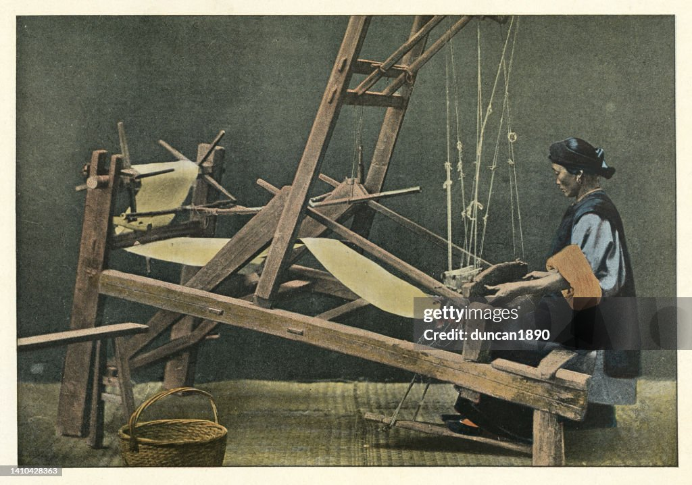

# Sistema de Telares del Siglo XIX

## Introducción

El siglo XIX fue un periodo de profundas transformaciones industriales, y los telares mecánicos fueron uno de los inventos clave que revolucionaron la industria textil. 

Estos sistemas no solo mejoraron la eficiencia y la velocidad de producción, sino que también marcaron el inicio de la automatización en la fabricación de tejidos, sentando las bases para la Revolución Industrial.

En esta página web, exploraremos:

- **Historia:** Desde los primeros inventos como la lanzadera volante, hasta los sistemas más complejos del telar mecánico.
- **Funcionamiento:** Cómo operaban estos ingenios tecnológicos y su relación con otros avances, como las tarjetas perforadas.
- **Impacto:** Los cambios económicos, sociales y laborales que desencadenaron en la industria textil.

---

## Contenido

- [Historia](historia.md): Conoce los orígenes y el desarrollo de los sistemas de telares.
- [Funcionamiento](funcionamiento.md): Descubre cómo funcionaban estas máquinas.
- [Impacto](impacto.md): Analiza las consecuencias de estos avances en la sociedad del siglo XIX.

---

Explora las diferentes secciones para comprender cómo los sistemas de telares transformaron el mundo.
=======

El siglo XIX fue un periodo de profundas transformaciones industriales, y los telares mecánicos fueron uno de los inventos clave que revolucionaron la industria textil. 

Estos sistemas no solo mejoraron la eficiencia y la velocidad de producción, sino que también marcaron el inicio de la automatización en la fabricación de tejidos, sentando las bases para la Revolución Industrial.

En esta página web, exploraremos:

- **Historia:** Desde los primeros inventos como la lanzadera volante, hasta los sistemas más complejos del telar mecánico.
- **Funcionamiento:** Cómo operaban estos ingenios tecnológicos y su relación con otros avances, como las tarjetas perforadas.
- **Impacto:** Los cambios económicos, sociales y laborales que desencadenaron en la industria textil.

---

## Contenido

- [Historia](historia.md): Conoce los orígenes y el desarrollo de los sistemas de telares.
- [Funcionamiento](funcionamiento.md): Descubre cómo funcionaban estas máquinas.
- [Impacto](impacto.md): Analiza las consecuencias de estos avances en la sociedad del siglo XIX.

---

Explora las diferentes secciones para comprender cómo los sistemas de telares transformaron el mundo.